# 🦷 UAE Smile Care: Integrated Dental Clinic Management Ecosystem

## Project Overview

**UAE Smile Care** is an end-to-end enterprise solution designed to bridge daily dental clinic operations with advanced data intelligence. Built using **Microsoft Power Apps** and **Power Automate**, with **SharePoint** serving as a flexible relational database, the system automates scheduling, financial calculations, and inventory tracking. The entire ecosystem feeds a unified data warehouse analyzed via an interactive **Power BI Dashboard** to deliver real-time business insights.

## Objectives

* **Eliminate Scheduling Conflicts:** Automate booking workflows to prevent overlapping medical appointments.
* **Automate Financial Commissions:** Deploy zero-touch calculations for doctors' dynamic commission rates based on completed treatments.
* **Proactive Inventory Management:** Implement automated stock alerts to eliminate sudden shortages of critical medical supplies.
* **Comprehensive Analytics:** Centralize clinic metrics into a single screen for monitoring growth, profits, and performance metrics.

---

### 📸 Application & Dashboard Interfaces

#### **1. Main Navigation Hub**

*A centralized landing page containing interactive quick-access icons to seamlessly navigate between all 7 core modules.*

#### **2. Doctors Management Module**

<table>
  <tr>
    <td align="center" width="50%">
      <b>Doctor Directory</b> 
      
    </td>
    <td align="center" width="50%">
      <b>Add/Edit Doctor Profile</b> 
      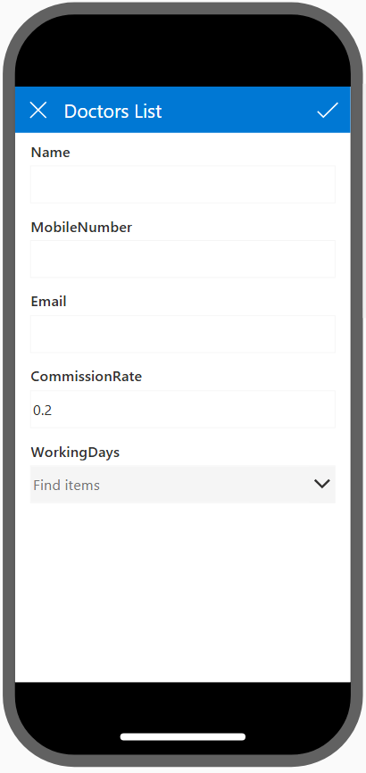
    </td>
  </tr>
</table>

 *Searchable directory displaying full active medical staff, communication details, and quick filter options.* | *Dedicated entry form for managing doctor onboarding, custom commission rates, and active working days.* |

#### **3. Patient & Medical Records Modules**

<table>
  <tr>
    <td align="center" width="50%">
      <b>Patients Directory</b> 
      
    </td>
    <td align="center" width="50%">
      <b>Add/Edit Patient Profile</b> 
      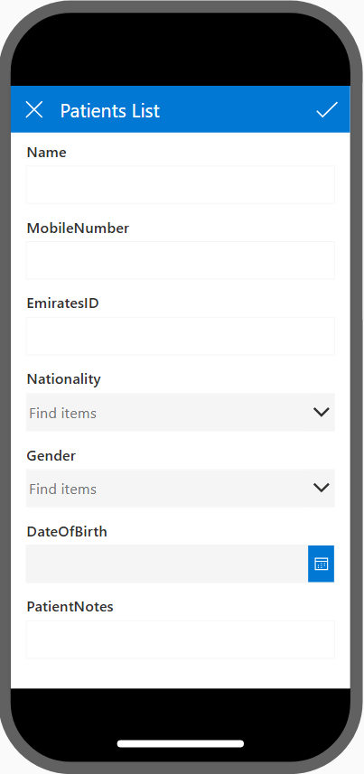
    </td>
  </tr>
</table>

#### **4. Human Resources & Operations**

<table>
  <tr>
    <td align="center" width="50%">
      <b>Employee Management</b> 
      
    </td>
    <td align="center" width="50%">
      <b>Add/Edit Employee Profile</b> 
      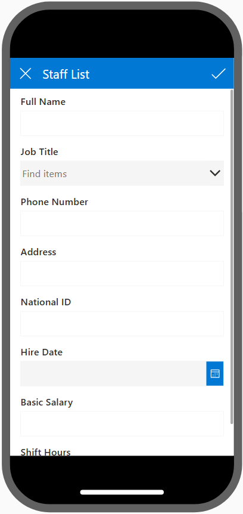
    </td>
  </tr>
</table>

#### **5. services management**

services discovery 
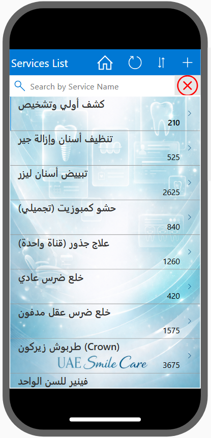

 Add/Edit services Profile 

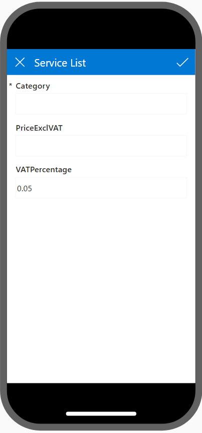

#### **6. inventory Systems**

inventory discovery 
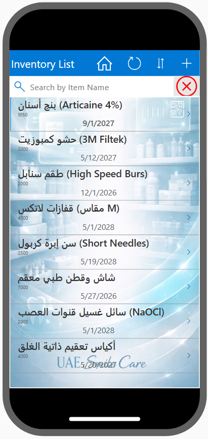

 Add/Edit inventory Profile 

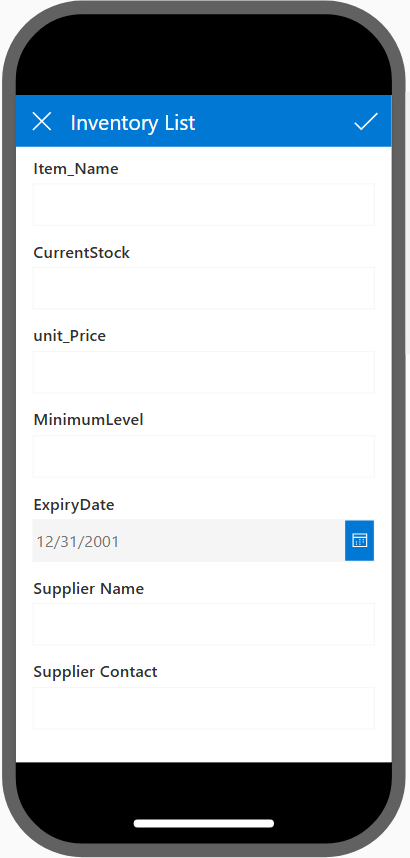

 ### **7. Invoicing & Financial Records** 
 Appointment discovery 
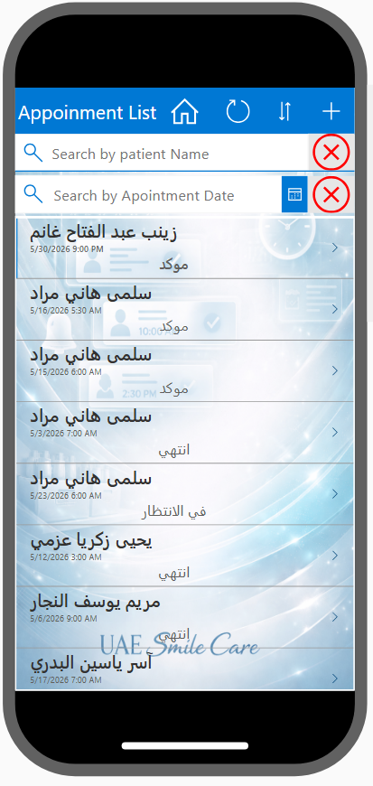

 Add/Edit Appointment Profile 

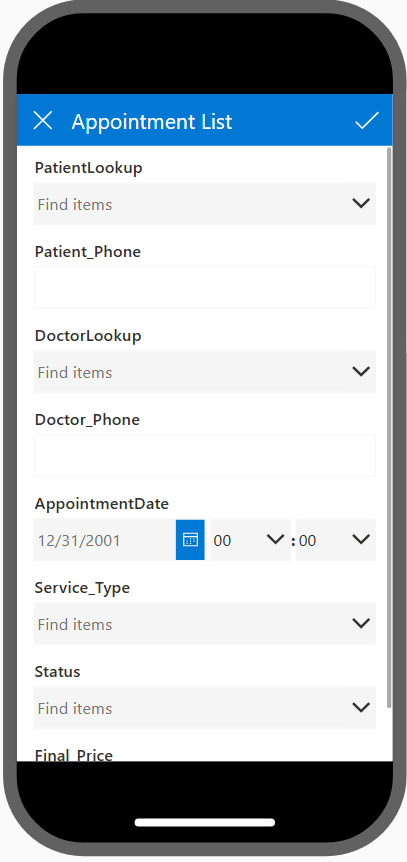

#### **8. Scheduling & Billing Systems**
 Billing discovery 

 Add/Edit invoice Profile 

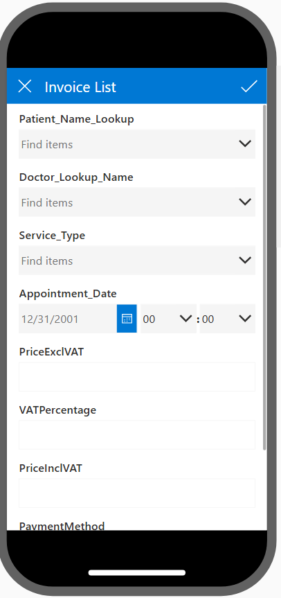

#### **9. Executive Power BI Dashboard**

*Interactive management dashboard utilizing a clean layout to display dynamic revenue growth, profitability metrics, and performance charts.*
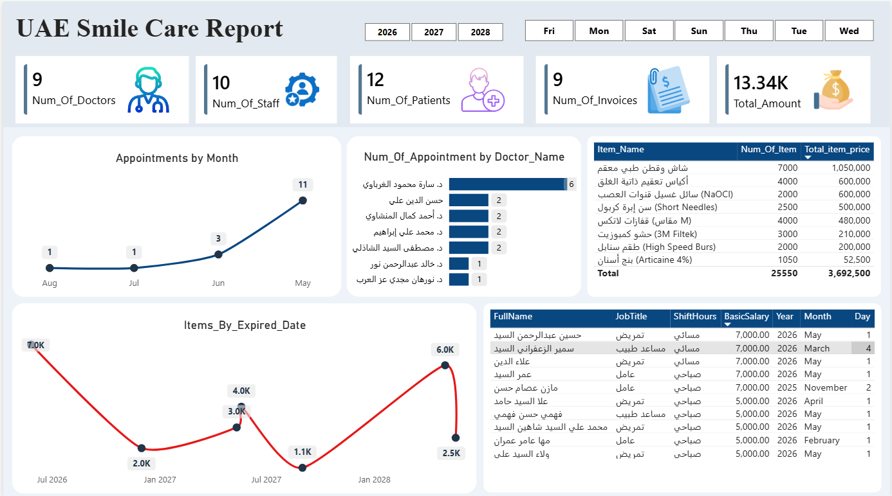

---

## 🛠 Tools & Technologies

* **Power Apps:** Designed a high-fidelity, responsive mobile interface covering 7 distinct business entities.
* **SharePoint:** Configured as a relational database optimized for fast querying and secure cloud storage.
* **Power Automate:** Programmed backend flows to handle hands-free invoice extraction and automated financial reporting.
* **Power BI Desktop:** Developed comprehensive reports backed by data architecture models.

---

## 📊 Data Architecture & Modeling

To ensure high-performance analytics and lightning-fast report loading, the Power BI backend is engineered using a classic **Star Schema** data model:

### **Model Breakdown**

* **Fact Table:** `Fact_Invoices` (stores financial transactions, quantities, and operational revenue).
* **Dimension Tables (Dim Tables):**
* `Dim_Doctors`, `Dim_Patients`, `Dim_Services`, `Dim_Employees`, `Dim_Inventory`, and `Dim_Appointments`.

* **Time Intelligence:** Integrated a dedicated, independent `dCalendar` dimension table linked via 1-to-many ($1:\infty$) relationships to enable time-intelligence calculations (Year-over-Year growth, Monthly comparisons).

---

## ⚙️ Core Operational Automated Logic

The ecosystem removes human error by applying built-in conditional logic across the workflows:

1. **Inventory Threshold Guard:**

$$\text{If } \text{Current Stock} \le \text{Minimum Safety Threshold} \rightarrow \text{Trigger Power Automate Emergency Alert}$$

2. **Automated Payout Matrix:**

$$\text{Doctor Net Commission} = \text{Invoice Treatment Cost} \times \text{Commission Rate}$$

---

## Author

**Amr Osama**

Data Scientist | Power Platform & Business Intelligence Specialist

* **LinkedIn:** [https://www.linkedin.com/in/amr-osama-el-sayed](https://www.google.com/search?q=https://www.linkedin.com/in/amr-osama-el-sayed)
* **Portfolio:** [https://mostaql.com/u/Amr_Osama_EL](https://www.google.com/search?q=https://mostaql.com/u/Amr_Osama_EL)

